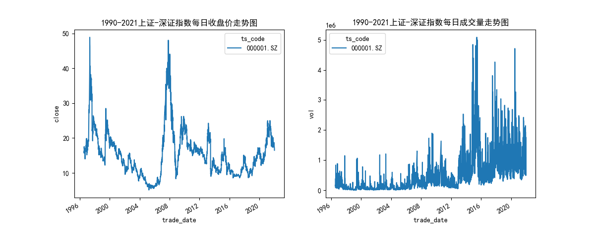

# 一.项目简介
  本项目主要利用python进行数据分析以及可视化，包括利用tushare库获取特定股票数据，利用pandas进行股票数据读取以及numpy进行股票相关指数分析，利用seaborn库以及matplotlib库进行可视化，最终利用折线图以及条形图等形式直观的表现对应股票的收益率以及风险分析结果
此项目包含以下文件
- [stock_analysis.py](stock_analysis.py)
- [trend_analysis.py](trend_analysis.py)
- [factor_trend_fig.py](factor_trend_fig.py)
- [Individual_stock_analysis.py](Individual_stock_analysis.py)
- [Individual_stock_analysis1.py](Individual_stock_analysis.py)
- [SH_SZ.csv](SH_SZ.csv)
- [stocks.csv](stocks.csv)

  其中，前三个文件是对000001.SZ(即平安银行)进行交易量走势图，开盘价，收盘价，最高价，最低价走势图进行分析绘制，SH_SZ.csv是利用tushare获取的交易数据,四五两个文件是选取了['平安银行':'000001.SZ','万科A':'000002.SZ','国农科技':'000004.SZ','世纪星源':'000005.SZ']等四支股票进行收益率以及风险分析的结果，并绘制了相应图表
# 二.项目实现
## 1.技术栈以及相关库
### （1）tushare库
tushare能够为用户方便快捷的获取大量可以用于金融分析的数据，数据内容将扩大到包含股票、基金、期货、债券、外汇、行业大数据，同时包括了数字货币行情等区块链数据的全数据品类的金融大数据平台，为各类金融投资和研究人员提供适用的数据和工具。
### （2）pandas库
### （3）numpy库
### （4）seaborn库
seaborn库是基于matplotlib库开发的高级数据可视化库，可以直接读取pandas数据框（DataFrame）,避免了matplotlib需要进行解包数据列等复杂操作，因此可以快速便捷的生成美观的统计图表，容易上手
### （5）matplotlib库
## 2.项目内容
### 项目一:000001.SZ(平安银行)股票1990-2021年收盘价以及交易量趋势分析
#### （1）读取通过tushare库获取的股票数据，以及数据的基础信息，如占用内存和数据类型,并保存到csv文件中
  本部分以文件stock_analysis.py为例，进行分析解释
  
  首先导入相关的模块，用于抓取数据，进行数据分析以及可视化
```python
import matplotlib.pyplot as plt
import pandas as pd
import tushare as ts
import numpy as np
import seaborn as sns
import datetime as dt
```
  首先用户需要在tushare官网进行注册，并在首页-个人主页-接口token中复制对应的toekn,用于在以下代码中连接到tushare账号，用于抓取数据。以下代码包括设置token,连接api以及利用tushare提供的daily方法对特定ts_code(即股票编号)在选取时间范围内的日交易数据（daily）进行抓取，注意，可以访问tushare官网，官网还提供了大量不同数据产品以及月交易数据，季度交易数据等多种格式的数据，对于某些数据产品，会收取一定积分（tushare内部货币）。然后将抓取的数据转化为便于pandas读取的csv文件格式，xxx.to_csv('name.csv',index=False,float_format='%.2f'),传入参数包括数据文件名（自定义），不传入行索引，以及保留两位小数
```python
ts.set_token("e3956f941d9ee613075ff03d85b50499687b6a646e7337e493dcf657")
pro=ts.pro_api()
df_sz = pro.daily(ts_code='000001.SZ', start_date='19901220', end_date='20211231')
print(df_sz)
df_sz.to_csv("SH_SZ.csv",index=False,float_format='%.2f')
```
#### (2)提前进行绘图基础配置，避免显示问题
  以下代码块主要实现了绘制图表的字体设置（'font.sans-serif'），正确显示负号('axes.unicode_minus'),以及规定了绘制图像包括一张12*5的画布，画布中包括两张子图，子图将画布分为一行两列，分别编号为1，2,进行坐标轴格式化以及设置标签
```python
#'SimHei'表示字体为黑体
plt.rcParams['font.sans-serif']='SimHei'
plt.rcParams['axes.unicode_minus']=False
fig=plt.figure(figsize=(12,5))
axes1=fig.add_subplot(1,2,1)
axes2=fig.add_subplot(1,2,2)
# 格式化x轴，只显示年份
date_format = mdates.DateFormatter('%Y')
axes1.xaxis.set_major_formatter(date_format)
axes2.xaxis.set_major_formatter(date_format)
# 自动调整x轴标签的显示
fig.autofmt_xdate()
```
#### (3)读取csv数据
  利用pandas.read_csv()来读取csv数据到data中，并注意需要将data中交易时间对应的trade_date类型修改为datetime类型（使用xxx['column_name']=pd.to_datetime(xxx['column_name',format='%Y%m%d'])），避免之后进行时间处理类型错误，以及绘制图表时的坐标轴显示问题
```python
#读取通过tushare库获取的股票数据，以及数据的基础信息，如占用内存和数据类型
data=pd.read_csv("SH_SZ.csv")
data.info()
#trade_date()列是object类型，因此需要转化为datetime类型,%Y%m%d表示对应的列中，时间是以yyyymmdd的格式出现的，注意Y（大写）
data['trade_date']=pd.to_datetime(data['trade_date'],format="%Y%m%d")
print("................")
print(data['trade_date'].dtype)
#展示数据的前五行
data.head()
```
#### (4)绘制图表
  直接利用set_title()设置图表标题，利用seaborn库的sns.lineplot(x=xxxx,y=xxxxx,hue=data.ts_code,ax=axes1)，分别设置x轴以及y轴对应的数据，hue=data.te_code表示按照ts_code分组，并且不同分组用不同颜色的线条绘制，绘制的图表是上述初始化图表中的axes1
```python
axes1.set_title("1990-2021上证-深证指数每日收盘价走势图")
sns.lineplot(x=data.trade_date,y=data.close,hue=data.ts_code,ax=axes1)
axes2.set_title("1990-2021上证-深证指数每日成交量走势图")
sns.lineplot(x=data.trade_date,y=data.vol,hue=data.ts_code,ax=axes2)
```
最终效果图如下所示

### 项目二:000001.SZ(平安银行)等四只股票2021年收益率以及风险分析
#### (1)读取对应股票数据
  这部分操作与上一个项目整体类似，但是利用了for循环来简化多只股票的读取,提前将需要读取的股票代码和名称存放在stocks字典中
```python
import matplotlib.pyplot as plt
import pandas as pd
import numpy as np
import seaborn as sns
import datetime as dt
import tushare as ts
plt.rcParams['font.sans-serif']='SimHei'
plt.rcParams['axes.unicode_minus']=False
ts.set_token("e3956f941d9ee613075ff03d85b50499687b6a646e7337e493dcf657")
pro=ts.pro_api()
#初始化df
df=pd.DataFrame()
#提前确定公司及其对应的股票代码
stocks={'平安银行':'000001.SZ','万科A':'000002.SZ','国农科技':'000004.SZ','世纪星源':'000005.SZ'}
for stock_code in stocks.values():
    df_stock = pro.daily(ts_code=stock_code, start_date='20210101')
    df = pd.concat([df,df_stock],ignore_index=True)
df.to_csv('stocks.csv')
```
#### (2)初始化操作完全一致，但是在绘制各股票年收益率时，横坐标是股票代码，因此需要将横坐标进行重新初始化
```python
#'SimHei'表示字体为黑体
plt.rcParams['font.sans-serif']='SimHei'
plt.rcParams['axes.unicode_minus']=False
fig=plt.figure(figsize=(12,5))
axes1=fig.add_subplot(1,2,1)
axes2=fig.add_subplot(1,2,2)
# 格式化x轴，只显示年份
date_format = mdates.DateFormatter('%Y')
axes1.xaxis.set_major_formatter(date_format)
axes2.xaxis.set_major_formatter(date_format)
# 自动调整x轴标签的显示
fig.autofmt_xdate()
```
#### (3)进行绝对日收益率（simple_return_daily）以及对数日收益率(long_return_daily)的函数定义，并对从csv文件中读取的data(DataFrame)进行应用，并创建新的列simple_return_daily以及long_return_daily，将定义好的函数应用(.transgorm(func_name))在按编号分组好的data.groupby('ts_code')['close']中，
```python
#收益分析
def simple_return_daily(series):
    #计算绝对日收益率,（当天收盘价-前一天收盘价）/当天收盘价
    s = (series-series.shift(1))/series.shift(1)
    return s

def long_return_daily(series):
    #计算对数日收益率
    s = np.log(series/series.shift(1))
    return s
data['simple_return_daily']=data.groupby('ts_code')['close'].transform(simple_return_daily)
data['long_return_daily']=data.groupby('ts_code')['close'].transform(long_return_daily)
```
#### (4)根据计算好的日收益率，进行累计日收益率以及年化收益率计算
    初始化年收益率列表return_yearly=[],然后按照编号来分别计算各只股票的累计日收益率以及年化收益率
```python
#初始化平均年化收益率数据
return_yearly=[]
stocks={'平安银行':'000001.SZ','万科A':'000002.SZ','国农科技':'000004.SZ','世纪星源':'000005.SZ'}
for stock_code in stocks.values():
    #将data中满足ts_code为当前stock_code的股票交易数据中['trade_date','ts_code','simple_return_daily','long_return_daily']的这几列进行提取
    stock_data=data[data.ts_code==stock_code][['trade_date','ts_code','simple_return_daily','long_return_daily']]
    #计算股票的累计日收益率,并在stock_data表中新建一列accumulate来存放，cumprod表示累积，dropna去除NAN值
    stock_data['accumulate']=(stock_data['simple_return_daily']+1).cumprod().dropna()
    #计算股票的年化收益率,注意公式np.mean()
    return_yearly.append((1+np.mean(stock_data['long_return_daily']))**252-1)
    #seaborn绘图
    axes1.set_title('2021年各股票的累计日收益率图')
    sns.lineplot(data=stock_data,x='trade_date',y='accumulate',ax=axes1)

#初始化平均年收益dataframe，并按照return_yearly数值进行排序，用于之后进行绘图
stocks_yearly=pd.DataFrame(columns=['ts_code','return_yearly'])
stocks_yearly['ts_code']=stocks.values()
stocks_yearly['ts_code']=stocks_yearly['ts_code'].astype(str)
stocks_yearly['return_yearly']=return_yearly
stocks_yearly.sort_values('return_yearly',inplace=True)
#按照不同公司代码，绘制平均年收益条形图,barplot
# 调整x轴标签显示方式,之前格式化为了年份，需要调整成ts_code
axes2.set_xticklabels(stocks_yearly['ts_code'], rotation=45, ha="right")
axes2.set_title('选定股票平均年化收益率图')
sns.barplot(data=stocks_yearly,x='ts_code',y='return_yearly',ax=axes2)
plt.show()
```
